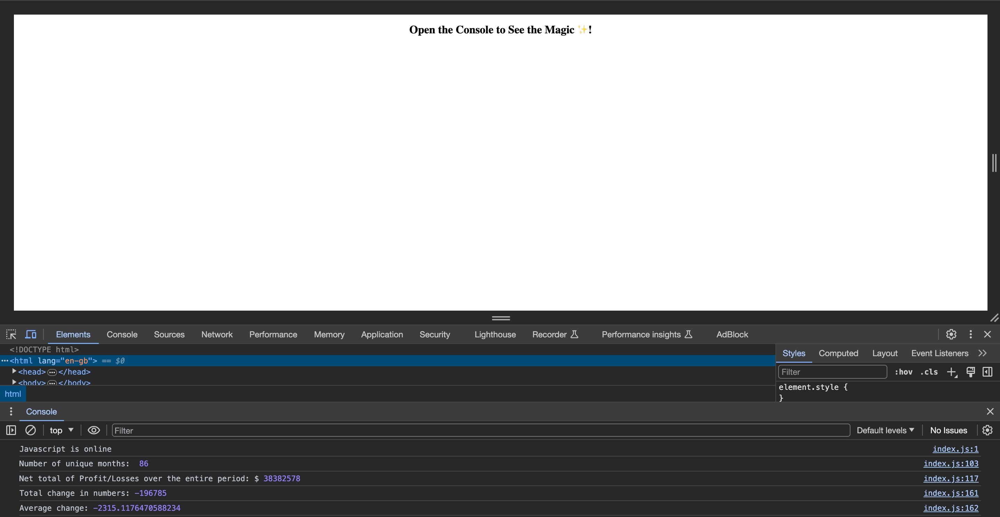

# console-finances
A console that analyses company datasets to produce various calculations about the company's finances.

## Description
In this project we were given a dataset surrounding a company's finances, within an array with two fields. One of the fields was the month and year, and the other was the profit/loss for the month. 

Utilisng Javascript functions, we were tasked with generating various calculations for the company's finances, including the number of months, the total net profit/loss over the entire period, the average change, as well as the greatest and lowest change in profit and losses. These calculations were to be displayed in the console log once completed.
## Installation
No installation required as application is a live webpage.
## Usage
To utilise this application you can visit the webpage by following this URL:

https://harrynewt0n.github.io/console-finances/

This should open up at webpage that looks like this:

Once on the webpage you can navigate to the console, and view the calculations, by right clicking on the screen and selecting 'Inspect".
## Credits
N/A

## License
MIT License

Copyright (c) 2023 harrynewt0n

Permission is hereby granted, free of charge, to any person obtaining a copy
of this software and associated documentation files (the "Software"), to deal
in the Software without restriction, including without limitation the rights
to use, copy, modify, merge, publish, distribute, sublicense, and/or sell
copies of the Software, and to permit persons to whom the Software is
furnished to do so, subject to the following conditions:

The above copyright notice and this permission notice shall be included in all
copies or substantial portions of the Software.

THE SOFTWARE IS PROVIDED "AS IS", WITHOUT WARRANTY OF ANY KIND, EXPRESS OR
IMPLIED, INCLUDING BUT NOT LIMITED TO THE WARRANTIES OF MERCHANTABILITY,
FITNESS FOR A PARTICULAR PURPOSE AND NONINFRINGEMENT. IN NO EVENT SHALL THE
AUTHORS OR COPYRIGHT HOLDERS BE LIABLE FOR ANY CLAIM, DAMAGES OR OTHER
LIABILITY, WHETHER IN AN ACTION OF CONTRACT, TORT OR OTHERWISE, ARISING FROM,
OUT OF OR IN CONNECTION WITH THE SOFTWARE OR THE USE OR OTHER DEALINGS IN THE
SOFTWARE.